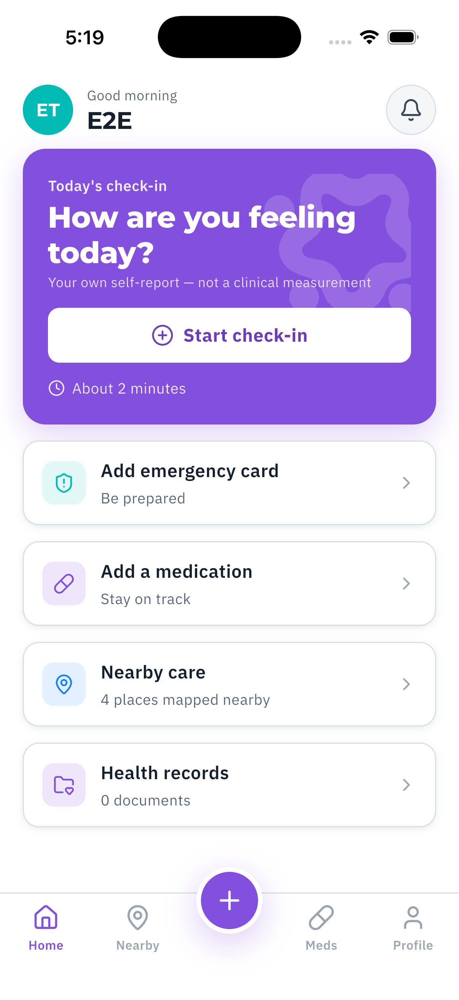
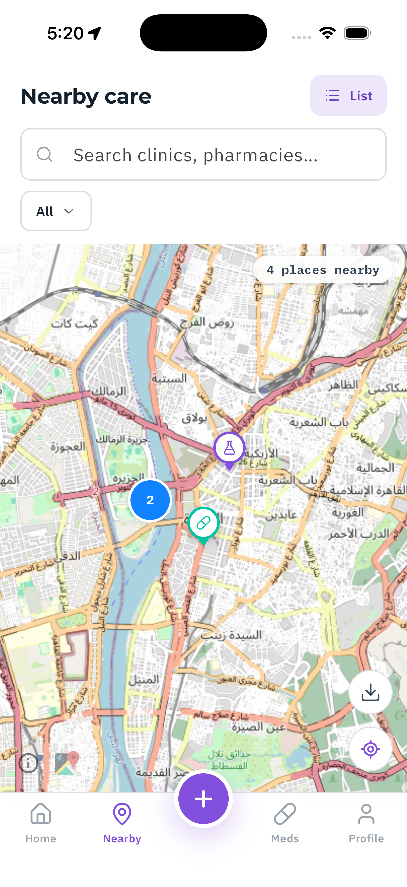
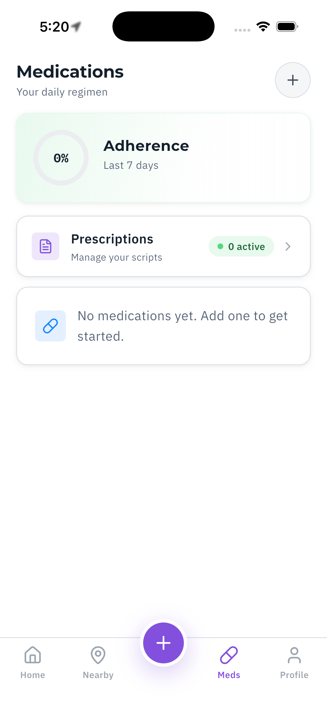
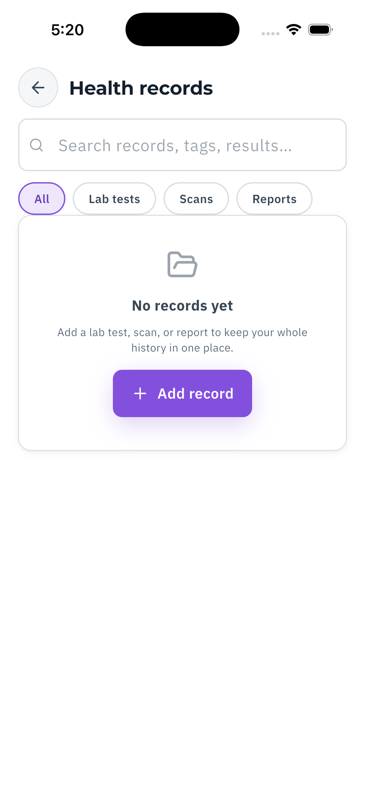
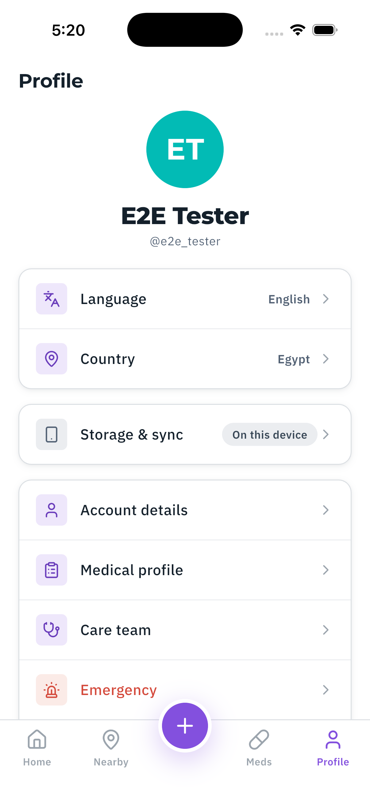

<p align="center">
  
</p>

# Balsm Patient App

Flutter app for the Balsm healthcare platform (iOS · Android · Web). Patients track
medications, self-reports, records, prescriptions, and an emergency medical profile —
**all health data stays on-device** (drift + SQLCipher); the backend only ever sees
encrypted or non-PHI payloads.

> **PHI rule (read first):** never log, print, or transmit PHI; never fabricate sample
> PHI in code or fixtures. Details in [CLAUDE.md](CLAUDE.md) and
> [CODING_STANDARDS.md](CODING_STANDARDS.md).

<p align="center">
  
  
  
  
  
</p>
<p align="center"><sub>Synthetic "E2E Tester" data — full set + regeneration guide in
<a href="docs/screenshots.md">docs/screenshots.md</a>.</sub></p>

## Repository map

Melos monorepo, three layers. Modules depend on `core`, never on each other —
cross-module reads go through core contracts/ports (enforced by `balsm_boundary_lint`).

| Path | Role |
|---|---|
| `app/` | Composition root: bootstrap, DI overrides, router, flavors, shell UI. The live patient UI lives in `app/lib/balsm_app/`. |
| `packages/core/` | Shared kernel: domain VOs, event bus, `AppDatabase` (SQLCipher), data-source ports, localization (i69n), design kit, telemetry, backup. |
| `packages/balsm_api/` | Typed HTTP client for Balsm-API-DotNet (Dio), file downloader, server switching. |
| `packages/balsm_boundary_lint/` | Custom lints enforcing the module-boundary rules. |
| `modules/<context>/` | Bounded contexts (12): account, auth, deletion, disclosure, emergency_card, geofence_block, medications, prescriptions, profile, records, self_report, sessions. Each: `domain/ application/ infrastructure/ presentation/ i18n/`. |

Every package/module has its own `README.md` with a frontmatter header
(`context / plane / features`) — start there when entering a directory.

## Setup from zero

```bash
# 1. Toolchain — Flutter is managed by fvm, version pinned in .fvmrc
brew install fvm            # or: dart pub global activate fvm
fvm install                 # installs the pinned SDK
fvm flutter doctor

# 2. Dependencies (melos workspace)
fvm dart pub get            # resolves the workspace root incl. melos

# 3. Build-time env (required — see app/env/README.md)
cp app/env/shared.example.json app/env/shared.json

# 4. Code generation (drift, i69n, riverpod, etc.)
fvm dart run melos run gen
```

Always invoke the SDK through `fvm flutter …` / `fvm dart …` — a bare `flutter`
on PATH may be the wrong version.

## Run / test / build

`tool/build.dart` is the single source of truth for flavor/target/`--dart-define`
wiring (shared by melos scripts, VS Code launch configs, and CI):

```bash
fvm dart run tool/build.dart run balsm dev            # run on default device
fvm dart run tool/build.dart run balsm dev --device=<id>
fvm dart run tool/build.dart test                     # tests
fvm dart run tool/build.dart apk balsm prod           # artifacts: apk aab ipa web macos …
fvm dart run tool/build.dart -h                       # full usage
```

The committed wrapper `bin/balsm` (`bin\balsm.cmd` on Windows) is the same
tool — used by CI, VS Code tasks, and melos. Full reference:
[docs/balsm-cli.md](docs/balsm-cli.md). For any-cwd shell use, alias it:

```sh
alias balsm=/path/to/balsm_app/bin/balsm
```

Melos equivalents: `melos run run:dev`, `melos run test`, `melos run analyze`,
`melos run gen`, `melos run boundaries` (see `melos.yaml`).

**iOS plugins** are managed by Swift Package Manager (Flutter 3.47 default) —
`Package.resolved` and the SwiftPM project state are committed; CocoaPods
remains only for the pods SwiftPM doesn't cover yet.

**Brands & environments:** brand `balsm` (entry `app/lib/brands/balsm/main_balsm.dart`,
Android flavor + iOS scheme `balsm`); environments `dev | staging | prod` from
`app/env/<brand>/<env>.json` + git-ignored `app/env/shared.json`.

## Widget previews

Design-system and widget previews live in `app/lib/balsm_app/previews/`:

```bash
cd app && ~/fvm/versions/$(jq -r .flutter ../.fvmrc)/bin/flutter widget-preview start
```

(Direct SDK path on purpose — `fvm flutter widget-preview` breaks on path
descriptors; see `previews/preview_harness.dart`.) Every preview is also pumped in
`app/test/previews_build_test.dart`, so a broken preview fails CI.

## Conventions that will bite you if skipped

- **Docs-with-code guard:** commits touching code must update docs or carry a
  `[skip-docs]` tag in the message.
- **i69n strings only** — no inline `ar ? … : …` ternaries; edit the JSON bundle,
  then run codegen in that package.
- **Scoped data sources** — PHI persistence goes through `ProfileDataSource` /
  `UserDataSource` ports, never `Drift*` concretes in domain/application layers.
- **Raw-SQL DAO convention** over drift's generated queries for new tables; new
  tables are never added to `SnapshotService._tables` without a ruling.
- **Shared date picker** — use the branded picker from core, never raw
  `showDatePicker`.

## Deeper docs

- Feature specs: `docs/superpowers/specs/` · implementation plans: `docs/superpowers/plans/`
- CI: `.github/workflows/` (`ci.yml` checks, `build-apks.yml`, `release.yml`).
  Pipelines run only for `main` / `develop` / `release/**` and PRs targeting
  them — work branches get CI through their PR, not on every push.
- CI secrets runbook: `docs/ci-secrets.md` · backup setup: `docs/google-drive-backup-setup.md`
- Org-wide rules: `../Balsm-Core/agents/rules/` (AGENTS.md, CODING_STANDARDS.md)
