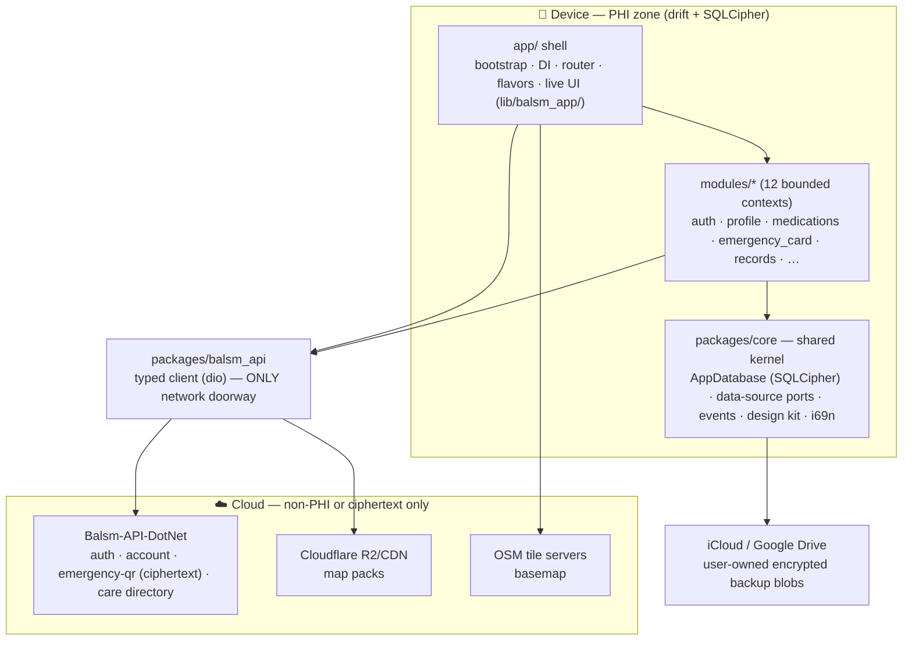

# balsm_app — architecture

One page for orientation; the binding rules live in [CLAUDE.md](../CLAUDE.md),
[CODING_STANDARDS.md](../CODING_STANDARDS.md) and
`../Balsm-Core/agents/rules/`. Per-package detail lives in each package's own
README (frontmatter: `context / plane / features`).

## The one diagram that matters

PHI stays on the device. Everything else follows from that.

What crosses the line, exhaustively: auth/session traffic, account summary
(non-PHI), the AES-256-GCM-encrypted emergency snapshot (key never leaves the
device — it rides only in the QR URL fragment), field-encrypted DOB, care
directory queries, map-pack downloads, and PHI-scrubbed telemetry. Nothing
else. `phi_leak_interceptor.dart` in balsm_api enforces the request side.

## Layers and the boundary rule

- **`app/`** — composition root. Binds core ports to module implementations,
  owns flavors/env and the live patient UI (`lib/balsm_app/`).
- **`modules/<context>/`** — bounded contexts, each split
  `domain / application / infrastructure / presentation / i18n`. Modules
  depend on `core` and `balsm_api`, **never on each other** — cross-context
  reads go through core contracts (`application/ports/`), cross-context
  writes through core `EventBus` events. `balsm_boundary_lint` fails the
  build on violations; `melos run boundaries` checks it locally.
- **`packages/core`** — shared kernel: typed IDs, event bus, `AppDatabase`,
  scoped data-source ports (`ProfileDataSource` per health profile,
  `UserDataSource` per account), localization, design kit, telemetry, backup.
- **`packages/balsm_api`** — hand-written DTOs + abstract per-area APIs
  (`AuthApi`, `EmergencyQrApi`, …) with dio implementations. Raw dio never
  appears in a feature module.

## Persistence

Three tiers, all on-device:

| Tier | Store | Examples |
|---|---|---|
| PHI | drift + SQLCipher via scoped data sources | profiles, meds, dose history, records |
| App state | SharedPreferences KV groups | tab, locale, flags |
| Secrets | platform keystore (`SecureStorageWrapper`) | session tokens, permanent-QR key |

Raw-SQL DAO convention for new tables; new tables never join
`SnapshotService._tables` without an explicit ruling (backup scope is a
decision, not a default).

## Where to read next

- Feature designs: [`superpowers/specs/`](superpowers/specs/) — the approved
  design history, one dated file per feature
- Execution plans: [`superpowers/plans/`](superpowers/plans/)
- CI secrets: [ci-secrets.md](ci-secrets.md) · Drive backup:
  [google-drive-backup-setup.md](google-drive-backup-setup.md)
- Server-side counterpart: `../Balsm-API-DotNet/docs/` (C4 diagrams, OpenAPI,
  Insomnia collections)
