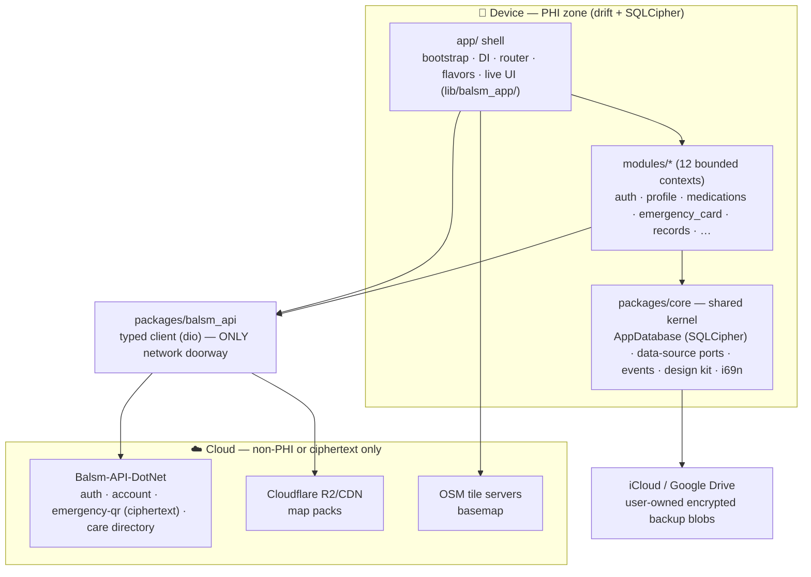

# balsm_app — architecture

One page for orientation; the binding rules live in [CLAUDE.md](../CLAUDE.md),
[CODING_STANDARDS.md](../CODING_STANDARDS.md) and
`../Balsm-Core/agents/rules/`. Per-package detail lives in each package's own
README (frontmatter: `context / plane / features`).

## The one diagram that matters

PHI stays on the device. Everything else follows from that.

```mermaid
flowchart TB
  subgraph device["📱 Device — PHI zone (drift + SQLCipher)"]
    shell["app/ shell<br/>bootstrap · DI · router · flavors · live UI (lib/balsm_app/)"]
    modules["modules/* (12 bounded contexts)<br/>auth · profile · medications · emergency_card · records · …"]
    core["packages/core — shared kernel<br/>AppDatabase (SQLCipher) · data-source ports · events · design kit · i69n"]
    shell --> modules --> core
  end

  api_pkg["packages/balsm_api<br/>typed client (dio) — ONLY network doorway"]
  modules --> api_pkg
  shell --> api_pkg

  subgraph cloud["☁️ Cloud — non-PHI or ciphertext only"]
    dotnet["Balsm-API-DotNet<br/>auth · account · emergency-qr (ciphertext) · care directory"]
    cdn["Cloudflare R2/CDN<br/>map packs"]
    osm["OSM tile servers<br/>basemap"]
  end

  api_pkg --> dotnet
  api_pkg --> cdn
  shell --> osm

  backup["iCloud / Google Drive<br/>user-owned encrypted backup blobs"]
  core --> backup
```

What crosses the line, exhaustively: auth/session traffic, account summary
(non-PHI), the AES-256-GCM-encrypted emergency snapshot (key never leaves the
device — it rides only in the QR URL fragment), field-encrypted DOB, care
directory queries, map-pack downloads, and PHI-scrubbed telemetry. Nothing
else. `phi_leak_interceptor.dart` in balsm_api enforces the request side.

Telemetry has two destinations, both behind core's `AnalyticsLogger` facade and
both scrubbed deny-by-default against `kTelemetryAllowlist`: **Sentry**
(crashes/diagnostics, always on) and **PostHog EU Cloud** (product analytics,
opt-out — the patient switches it off in Profile → Privacy & data). Session replay
is off on every surface. See
`docs/superpowers/specs/2026-09-30-posthog-product-analytics.md`.

## Layers and the boundary rule

- **`app/`** — composition root. Binds core ports to module implementations,
  owns flavors/env and the live patient UI (`lib/balsm_app/`).
- **`modules/<context>/`** — bounded contexts, each split
  `domain / application / infrastructure / presentation / i18n`. Modules
  depend on `core` and `balsm_api`, **never on each other** — cross-context
  reads go through core contracts (`application/ports/`), cross-context
  writes through core `EventBus` events. `balsm_boundary_lint` fails the
  build on violations; `melos run boundaries` checks it locally.
- **`packages/core`** — shared kernel: typed IDs, event bus, `AppDatabase`,
  scoped data-source ports (`ProfileDataSource` per health profile,
  `UserDataSource` per account), localization, design kit, telemetry, backup.
- **`packages/balsm_api`** — hand-written DTOs + abstract per-area APIs
  (`AuthApi`, `EmergencyQrApi`, …) with dio implementations. Raw dio never
  appears in a feature module.

### Ports a module owns

A module that needs something it may not import declares the interface itself,
under its own `application/ports/`, and `app/` binds the implementation at
bootstrap. Core contracts are for what several contexts share; a port like this
is for one context's private dependency — `deletion` needing re-auth, `account`
needing the geofence's denied countries, `auth` needing social credentials.

The default implementation **fails closed**. `ReauthPort` unbound returns
`UnauthorizedFailure`, so an app that forgets the override cannot advance the
flow rather than advancing it unproven. Anything guarding an irreversible or
PHI-bearing action follows that rule: the recoverable direction is the one that
refuses.

### Public routes

Four paths the shell serves from `Uri.base` on web **before** the auth gate,
listed in `PublicQrPaths`:

| Path | Screen | Why it cannot require a session |
|---|---|---|
| `/t/{jti}#k=` | emergency resolve | scanned by a responder who has no account |
| `/emergency/{jti}#k=` | same, dev-era alias | codes already in the wild |
| `/delete-account` | public delete | Google Play requires it to work without the app installed |
| `/delete-account-cancel` | cancel a pending delete | linked from the confirmation email |

Session-less does not mean unauthenticated: the deletion screens prove identity
in-screen with a one-time code through `ReauthPort` before anything is erased.

## Persistence

Three tiers, all on-device:

| Tier | Store | Examples |
|---|---|---|
| PHI | drift + SQLCipher via scoped data sources | profiles, meds, dose history, records |
| App state | SharedPreferences KV groups | tab, locale, flags |
| Secrets | platform keystore (`SecureStorageWrapper`) | session tokens, permanent-QR key |

Raw-SQL DAO convention for new tables; new tables never join
`SnapshotService._tables` without an explicit ruling (backup scope is a
decision, not a default).

## Where to read next

- Feature designs: [`superpowers/specs/`](superpowers/specs/) — the approved
  design history, one dated file per feature
- Execution plans: [`superpowers/plans/`](superpowers/plans/)
- CI secrets: [ci-secrets.md](ci-secrets.md) · Drive backup:
  [google-drive-backup-setup.md](google-drive-backup-setup.md)
- Server-side counterpart: `../Balsm-API-DotNet/docs/` (C4 diagrams, OpenAPI,
  Insomnia collections)
