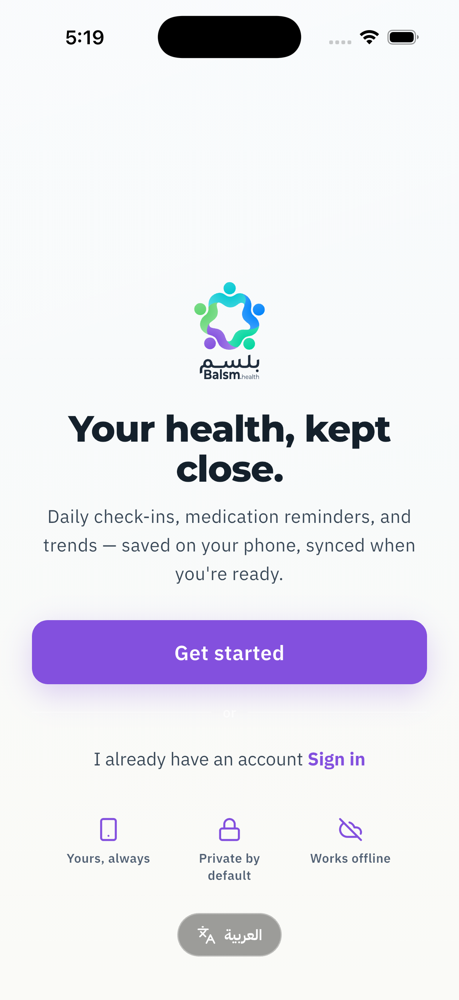
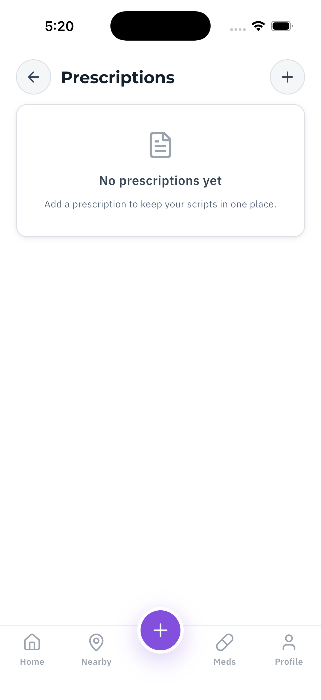
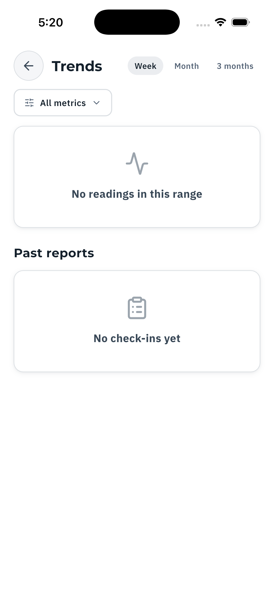

# App screenshots

Current UI, captured from the real app on an iOS simulator running the
**docs entrypoint** (`lib/brands/balsm/main_docshots.dart`): the same fake
APIs as e2e plus a pre-seeded synthetic session, so the shell renders
signed-in as the "E2E Tester" fixture — synthetic by construction, no PHI can
appear in a capture.

Regenerate (booted simulator, from `app/`):

```sh
UDID=<booted-simulator-udid>
xcrun simctl uninstall $UDID app.balsm.health; xcrun simctl keychain $UDID reset
fvm flutter run --flavor balsm -t lib/brands/balsm/main_docshots.dart \
  --dart-define-from-file=env/balsm/dev.json \
  --dart-define-from-file=env/shared.json -d $UDID
# once running: grant location (map tab) and drive the captures
xcrun simctl privacy $UDID grant location app.balsm.health
fvm dart run tool/docshots.dart <vm-service-uri-from-run-output> $UDID
```

Captures use `simctl io screenshot` while `tool/docshots.dart` navigates via
the app's `ext.balsm.*` debug extensions — add a `shot()` step there when a
new screen should appear here. (integration_test's takeScreenshot channel
returned blank frames on iOS and a queued location-permission dialog blanks
everything — hence the external-capture design and the pre-grant step.)

## Onboarding

| Welcome |
|---|
|  |

## Main shell

| Home | Care map | Medications |
|---|---|---|
|  |  |  |

| Prescriptions | Records | Trends | Profile |
|---|---|---|---|
|  |  |  |  |
