# App screenshots

Current UI, captured from the real app on an iOS simulator running the
**docs entrypoint** (`lib/brands/balsm/main_docshots.dart`): the same fake
APIs as e2e plus a pre-seeded synthetic session, so the shell renders
signed-in as a synthetic persona (`docshots_persona.dart`).

Captured in **both supported languages** — `screenshots/en/` and
`screenshots/ar/`. Arabic is not a translation pass over the English capture:
RTL mirrors the whole layout, so each locale needs its own photograph of every
screen.

> **Synthetic clinical data.** `docshots_seed.dart` writes a fabricated
> medication regimen into the on-device DB so the clinical screens capture with
> content instead of empty states. It is the one sanctioned exception to the
> repo's no-invented-PHI rule, is referenced only by the docshots entrypoint
> (tree-shaken out of shipped builds), and is never uploaded. Read the header of
> that file before reusing anything in it.

Regenerate (booted simulator, from `app/`):

```sh
UDID=<booted-simulator-udid>
xcrun simctl uninstall $UDID app.balsm.health; xcrun simctl keychain $UDID reset
fvm flutter run --flavor balsm -t lib/brands/balsm/main_docshots.dart \
  --dart-define-from-file=env/balsm/dev.json \
  --dart-define-from-file=env/shared.json -d $UDID
# once running: grant location (map tab) and drive the captures
xcrun simctl privacy $UDID grant location app.balsm.health
fvm dart run tool/docshots.dart <vm-service-uri-from-run-output> $UDID
# optional 3rd arg redirects output (store captures write elsewhere)
```

Captures use `simctl io screenshot` while `tool/docshots.dart` navigates via
the app's `ext.balsm.*` debug extensions — add a `shot()` step there when a
new screen should appear here. `ext.balsm.setLang` switches locale in-place, so
one run produces every language.

**Uninstall first, every time.** The account read-model is served from a
`CachedValue` and the seeded DB persists across launches, so a re-run against an
existing install captures the previous run's identity and data. (integration_test's takeScreenshot channel
returned blank frames on iOS and a queued location-permission dialog blanks
everything — hence the external-capture design and the pre-grant step.)

## Onboarding

| Welcome (en) | Welcome (ar) |
|---|---|
| 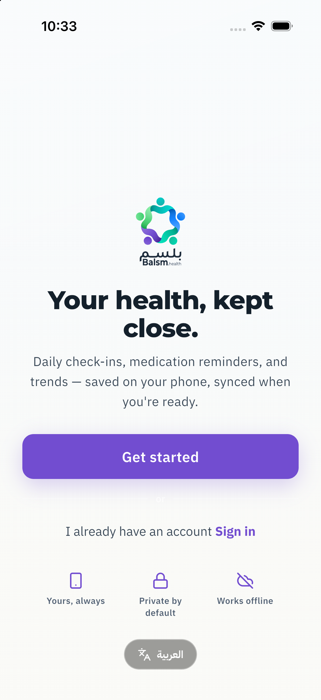 | 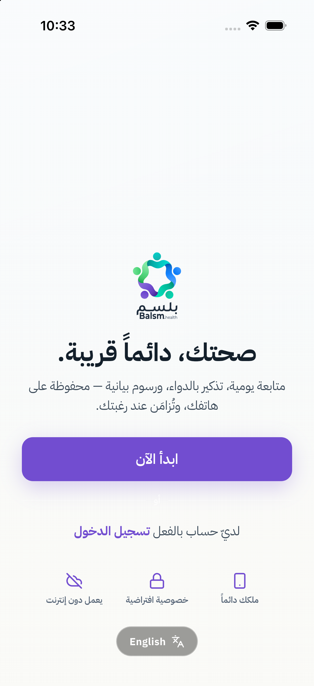 |

## Main shell

### English

| Home | Care map | Medications | Prescriptions |
|---|---|---|---|
| 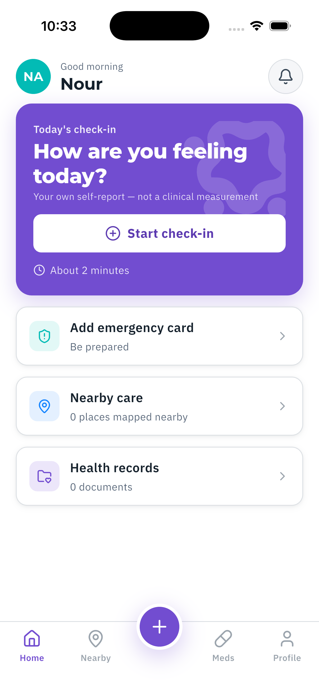 | 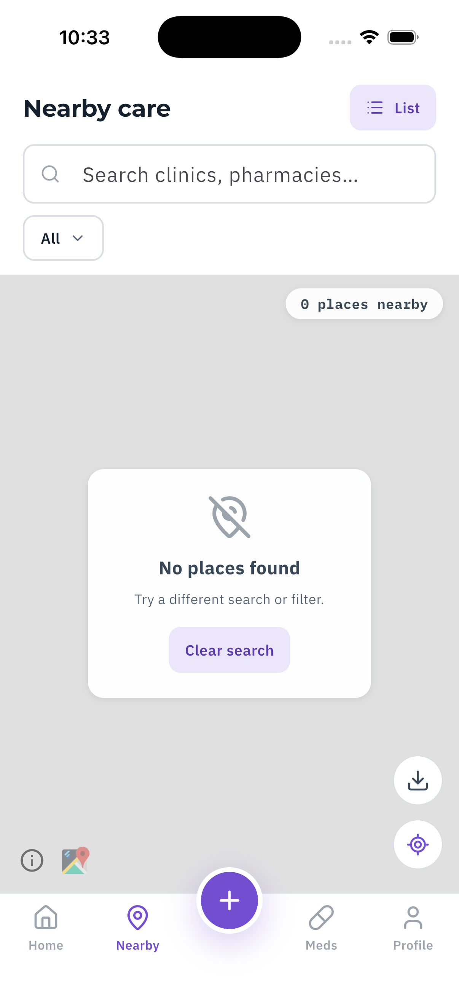 | 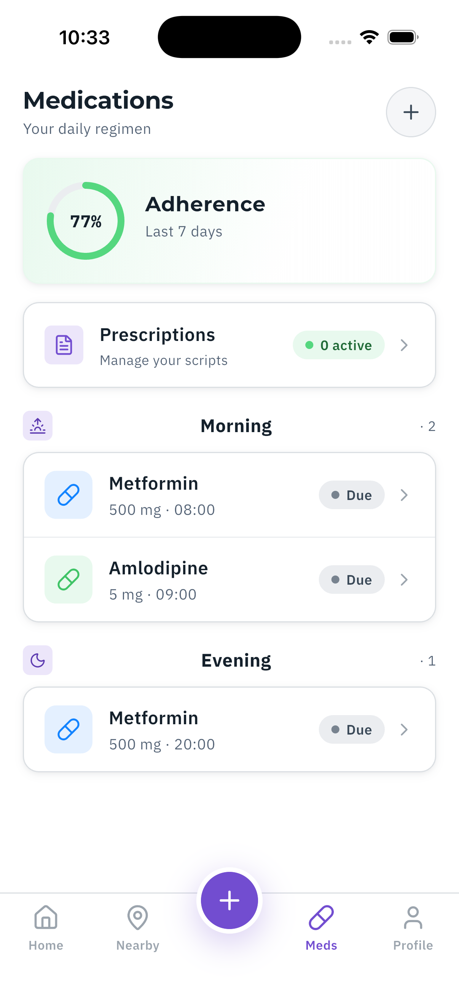 | 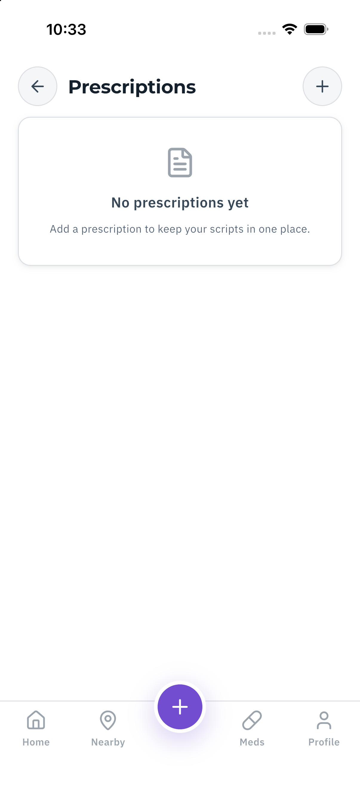 |

| Records | Trends | Profile |
|---|---|---|
| 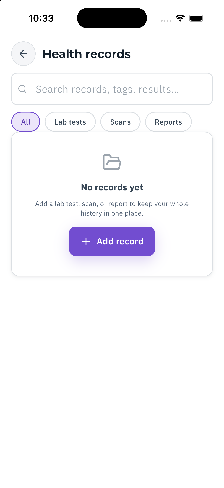 | 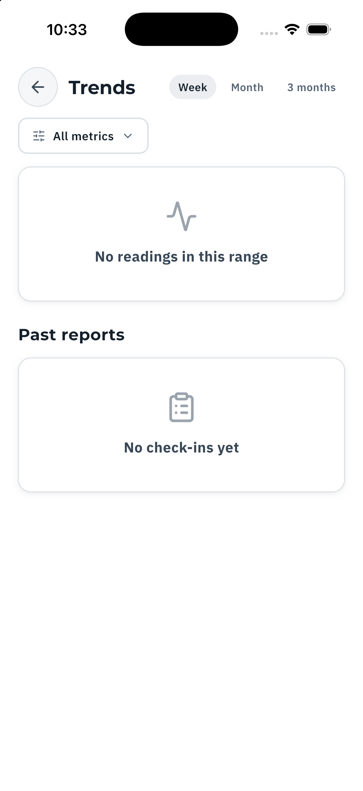 | 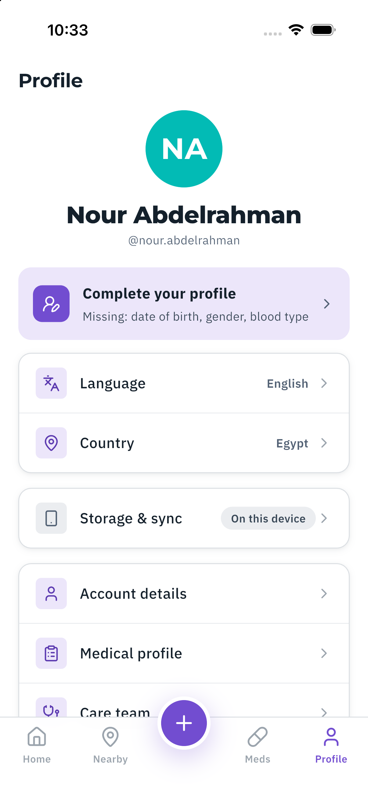 |

### العربية

| Home | Care map | Medications | Prescriptions |
|---|---|---|---|
| 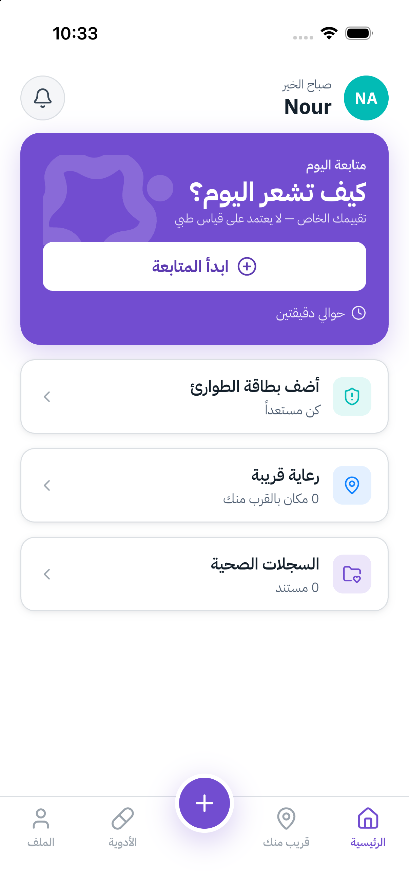 | 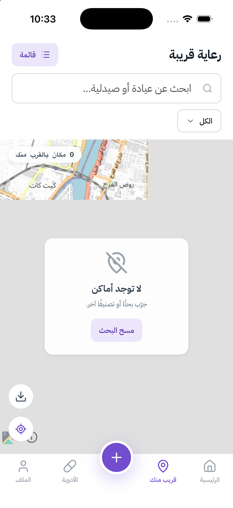 | 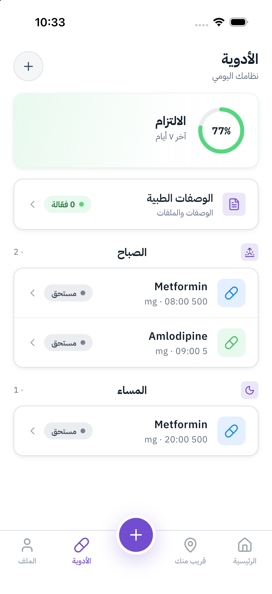 | 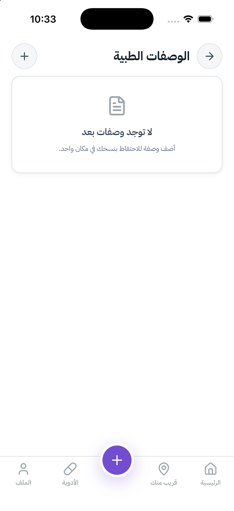 |

| Records | Trends | Profile |
|---|---|---|
| 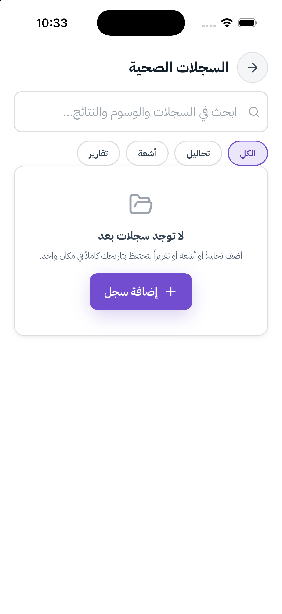 | 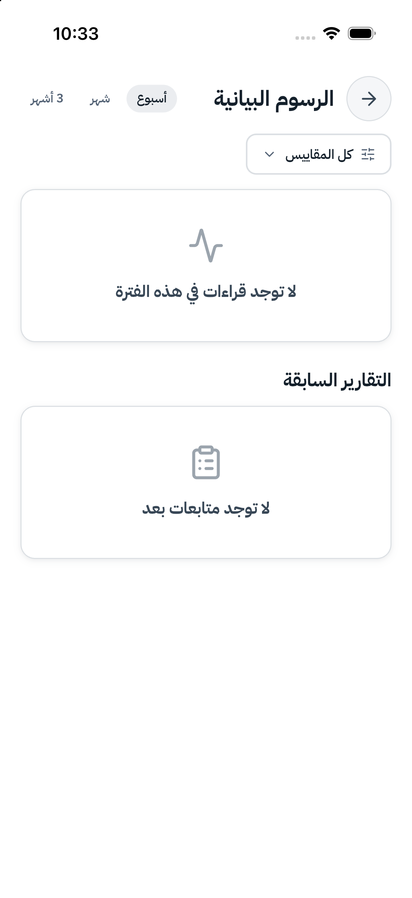 | 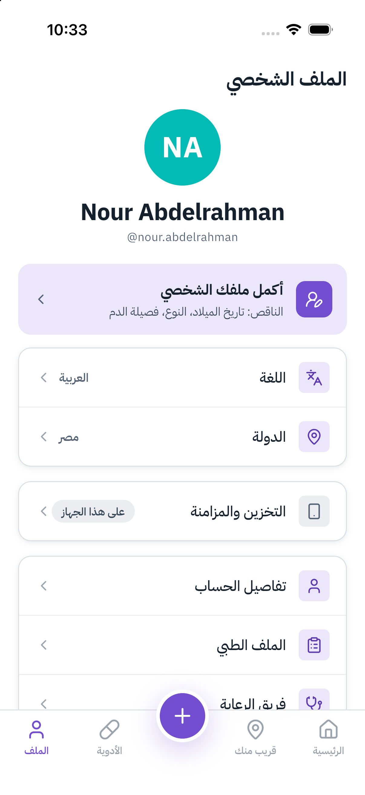 |
